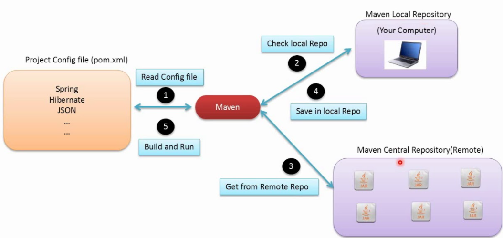
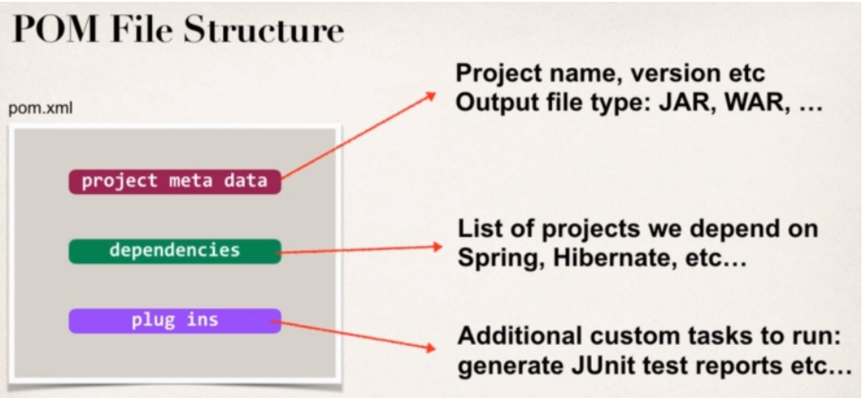

# maven
About maven

### What is maven?
- Maven is a software project Management and comprehension tool. Based on the concept of a project object model(POM), Maven can manage a project's build, reporting and documentation from a central piece of information
### Why maven?
#### Problem:
When building your Java Project, you may need additional JAR files e.g. Spring, Hibernate, Commons Logging, JSON etc
One approach is to download JAR files from each project web site
Manually add the JAR files to your build path/classpath
This is cumbersome manual approach to download JAR from each project site and then copy
#### Solution:
Tell Maven the dependencies (the projects you are working with) e.g. Spring, Hibernate
Maven will go out and download the JAR files for those projects for you 
Maven will make those JAR files available during compile/run time
Maven is like a helping friend
Project Config file (list of dependencies i.e. shopping list :))
### How Maven Works?

### Maven Key Concepts:
#### POM File - pom.xml
- For every project you have to manage a pom.xml file. This file contains information about the project and configuration used by Maven to build the project. Everything for your Maven build is defined within this POM file.

#### Project Coordinates
- Project Coordinates uniquely identify a project
- groupId: Name of organization, convention is to use reverse domain name
- artifactId: Name of the project

### Repository

#### Local Repository
- Located on developer's computer  
Windows c:\Users\<user home directory>/.m2/repository  
Mac\Linux ~/.m2/repository
- Maven search local repository before going out to central repository
#### Central Repository
- By default, Maven will search Maven's Central Repository (remote)  
https://repo.maven.apache.org/maven2
- Requires an Internet connection
Once files are downloaded, they are stored in local repository

### References:
- http://maven.apache.org/guides/
- https://www.jrebel.com/blog/maven-cheat-sheet
