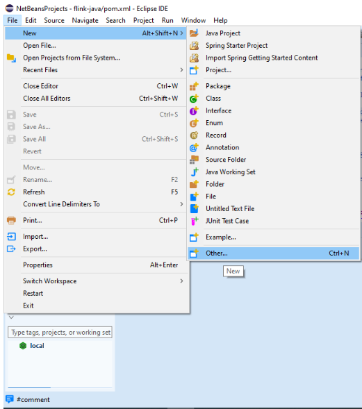
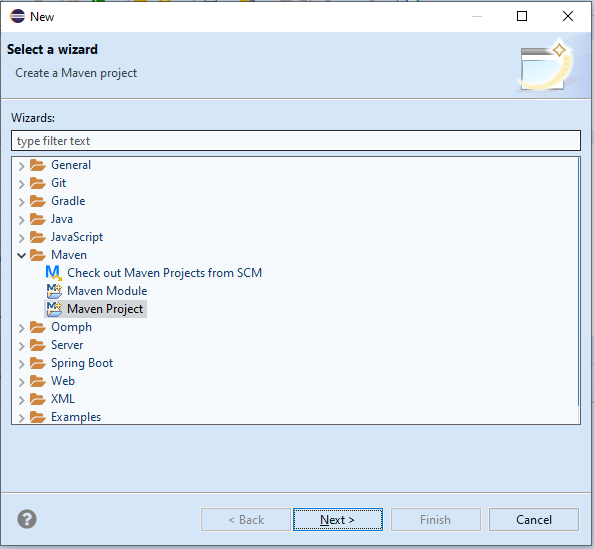
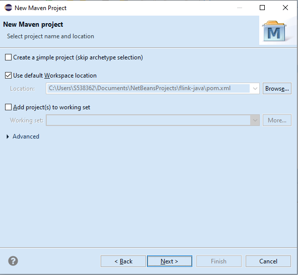
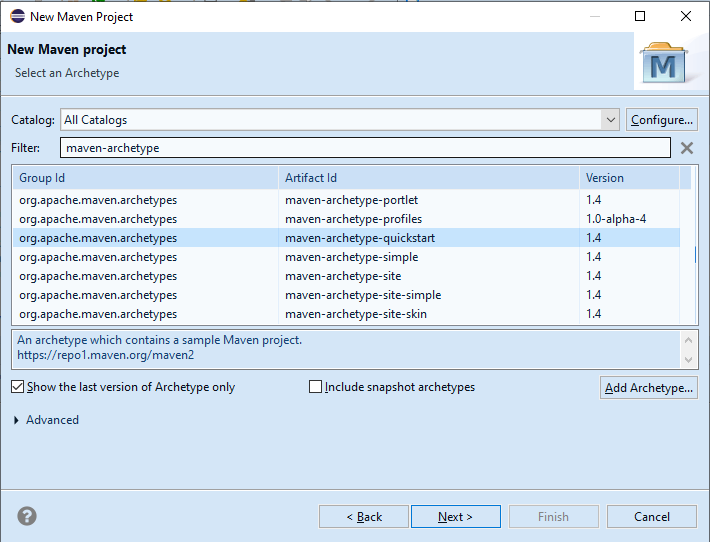
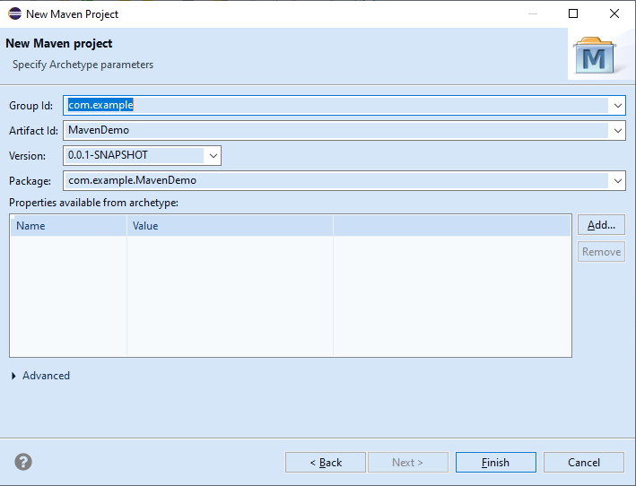
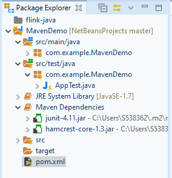
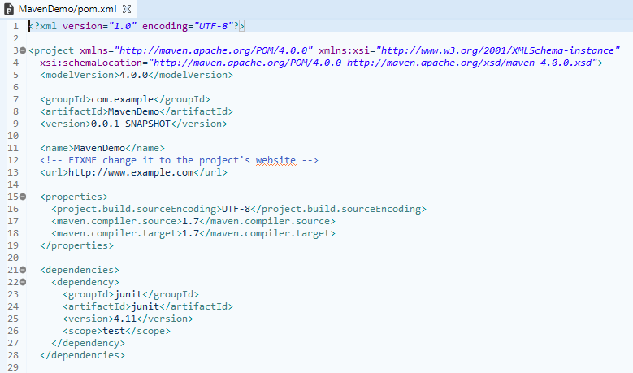

# Create a New Maven Project in Eclipse

1. Open your eclipse and Go to File > New > Others.

2. Select Maven > Maven Project and click on Next.

3. Choose your workspace where you would like to set up your Maven project and click on Next.

4. Search the archetype in filter, for now just select the 'maven-archetype-quickstart' and click on Next.(Make sure you should have internet connection as it is going to retrieve maven projects)

5. Specify the Group Id & Artifact Id and click on Finish.
    - GroupId- a package of a new project.
    - ArtifactId- a name of your project.
    - Version- a version of a new project. By default, this field is specified automatically.

6.  Go to the project location to see the newly created maven project with below following directory structure

7. Now open the pom.xml file, which resides in the project folder. By default the POM is generated like this:

8. Succesfully created a demo maven project